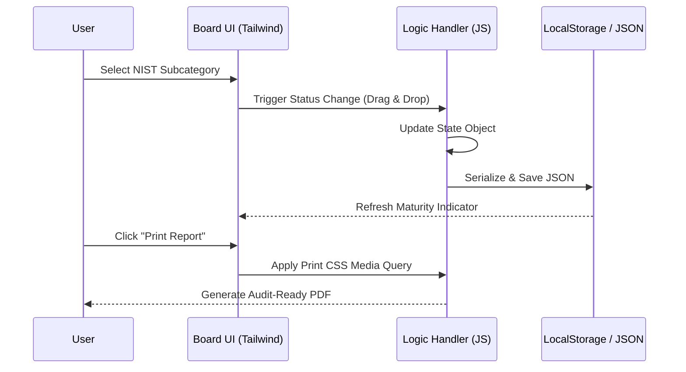
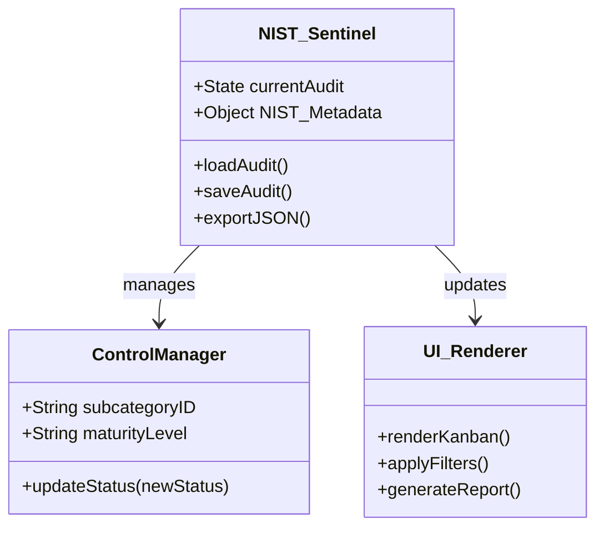

# 🛡️ NIST Sentinel: Cybersecurity Framework (CSF) 2.0 Compliance Tool

<p align="center">
  
</p>

<p align="center">
  <a href="https://www.youtube.com/watch?v=MbYpAKBpVT4">
    
  </a>
  
  
</p>

**NIST Sentinel** is a high-performance orchestrator designed to simplify, visualize, and manage cybersecurity audits. Built specifically for the **NIST CSF 2.0**, it transforms complex compliance requirements into an intuitive, action-oriented workflow for modern security teams.

---

## 📖 Deep Dive: What is the NIST CSF 2.0?

The **NIST Cybersecurity Framework (CSF) 2.0** is the global gold standard for managing and reducing cybersecurity risk. Developed by the *National Institute of Standards and Technology*, it provides a common language and systematic methodology for organizations to understand, implement, and prioritize their security posture.

> **Official Resource:** [Explore the NIST CSF 2.0 Framework Official Site](https://www.nist.gov/cyberframework) 🌐

---

## 🎯 Technical Value Proposition

* **For Auditors:** Transition from static "Excel-based audits" to a visual Kanban system that tracks control maturity in real-time.
* **For IT Managers:** Gain immediate visibility into which controls are pending, in progress, or successfully assessed across all Core functions.
* **For Compliance Officers:** Ensure total **Data Sovereignty**. Since the tool is serverless, sensitive audit data never leaves the local environment.

---

## 🚀 Key Features & Core Modules

### 📋 Interactive Audit Board

Manage the full lifecycle of a NIST subcategory with a simple drag-and-drop interface. It supports the entire NIST CSF 2.0 Core:

* **Govern (GV):** Establish and monitor the organization’s cybersecurity risk management strategy.
* **Identify (ID):** Understand the cybersecurity risk to assets, data, and capabilities.
* **Protect (PR):** Develop and implement appropriate safeguards.
* **Detect (DE):** Identify the occurrence of a cybersecurity event.
* **Respond (RS):** Take action regarding a detected cybersecurity incident.
* **Recover (RC):** Restore any capabilities or services impaired due to an incident.

### 💾 Privacy by Design (Air-Gapped Ready)

Built for high-security environments, Sentinel uses a **Zero-Server Architecture**:

* **Zero Database Footprint:** Leverages the browser's secure `LocalStorage` API.
* **Air-Gapped Operations:** Ideal for secure environments where internet access is restricted or prohibited.
* **Portable State Serialization:** Export your entire audit as a **JSON file** to resume sessions on any device.

### 🖨️ Professional Reporting

The tool features a specialized CSS print layer that removes UI clutter, producing "presentation-ready" PDF documents for stakeholders.

---

## 🏗️ System Architecture & Design (UML)

To ensure transparency for IT auditors and developers, the system follows a **Modular Client-Side Logic** pattern.

### 1. Functional Logic Flow (Sequence Diagram)

NIST Sentinel operates as a closed loop between the User Interface and the Browser's Persistence Layer.



### 2. Class Structure (State Management)

The application architecture is centered around a high-fidelity synchronization model:



---

## 🔧 Installation & Usage

1. **Clone the repository:**

```bash
git clone https://github.com/KaledSML/nist-sentinel.git

```

2. **Launch:** Open `index.html` in any modern web browser.
3. **Audit:** Select a category and start dragging controls based on your current maturity level.

---

> [!IMPORTANT]
> ### 🛡️ NIST SENTINEL: SECURITY ADVISORY
> 
> 
> **Developer:** [kaledsml](https://github.com/kaledsml)
> **Status:** `Stable / Production Ready`
> **Data Policy:** `Zero-Knowledge Architecture`
> *Engineering secure solutions from the bit level up.* > Any data processed by this tool remains within the user's local security perimeter. No external APIs or tracking scripts are used.

---
