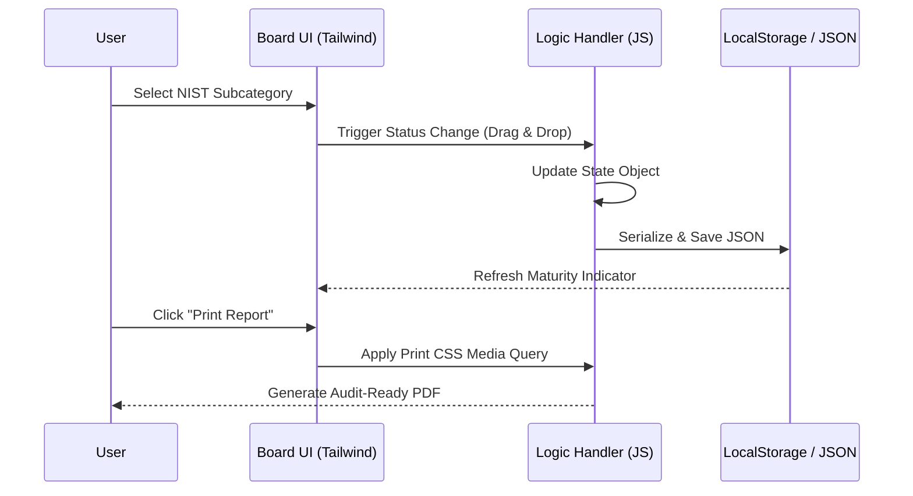
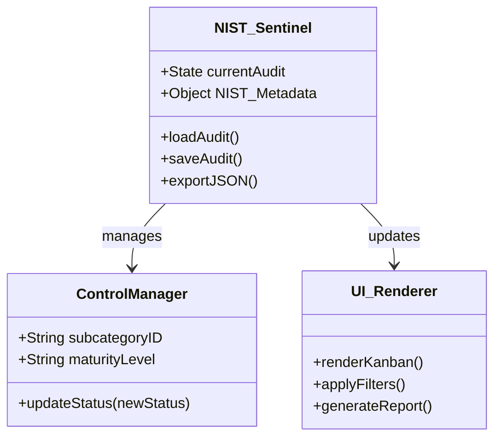

# 🛡️ NIST Sentinel: Cybersecurity Framework (CSF) 2.0 Compliance Tool

**NIST Sentinel** is a professional-grade orchestrator designed to simplify, visualize, and manage cybersecurity audits. Built specifically for the **NIST CSF 2.0**, it transforms complex compliance requirements into an intuitive, action-oriented workflow.

---

## 📖 What is the NIST CSF 2.0?
The **NIST Cybersecurity Framework (CSF) 2.0** is the global gold standard for managing and reducing cybersecurity risk. Developed by the *National Institute of Standards and Technology*, it provides a common language and systematic methodology for organizations to understand, implement, and prioritize their security posture.

> **Official Resource:** [Explore the NIST CSF 2.0 Framework Official Site](https://www.nist.gov/cyberframework) 🌐

---

## 🎯 Technical Value Proposition

* **For Auditors:** Transition from static "Excel-based audits" to a visual Kanban system that tracks control maturity in real-time.
* **For IT Managers:** Gain immediate visibility into which controls are pending, in progress, or successfully assessed across the **Govern, Identify, Protect, Detect, Respond, and Recover** functions.
* **For Compliance Officers:** Ensure total **Data Sovereignty**. Since the tool is serverless, sensitive audit data never leaves the local environment.

---

## 🚀 Key Features

### 📋 Interactive Audit Board

Manage the full lifecycle of a NIST subcategory with a simple drag-and-drop interface. It supports the entire NIST CSF 2.0 Core:

* **Govern (GV)**;
* **Identify (ID)**;
* **Protect (PR)**;
* **Detect (DE)**;
* **Respond (RS)**;
* **Recover (RC)**.
  

### 💾 Privacy by Design (Air-Gapped Ready)

Built for high-security environments, Sentinel uses a **Zero-Server Architecture**:
* **No Databases:** Leverages the browser's secure `LocalStorage`.
* **No Cloud Dependency:** Ideal for secure or restricted environments where internet access is limited.
* **Portable Sessions:** Export your entire audit as a **JSON file** to resume it later on any device.
  

### 🖨️ Professional Reporting

Generate clean, audit-ready summaries. The tool features a specialized CSS print layer that removes UI clutter, producing "presentation-ready" PDF documents for stakeholders.

---

## 🏗️ System Architecture & Design (UML)

To ensure transparency for IT auditors and developers, the system follows a **Modular Client-Side Logic** pattern.

### 1. Functional Logic Flow (Sequence Diagram)

NIST Sentinel operates as a closed loop between the User Interface and the Browser's Persistence Layer.

### 2. Class Structure (State Management)

The application architecture is centered around a high-fidelity synchronization model:

---

## 📥 Getting Started

No installation or complex configuration required:

1. **Clone the repository:** `git clone https://github.com/KaledSML/nist-sentinel.git`
2. **Launch:** Open `index.html` in any modern web browser.
3. **Audit:** Start mapping your security posture immediately.

---

> [!IMPORTANT]
> ### 🛡️ NIST SENTINEL: SECURITY ADVISORY
> **Developer:** [kaledsml](https://github.com/kaledsml)  
> **Status:** `Stable / Production Ready`  
> **Encryption:** `Local-Only (Client-Side)`
>
> *Engineering secure solutions from the bit level up.* > Any data processed by this tool remains within the user's local security perimeter.
